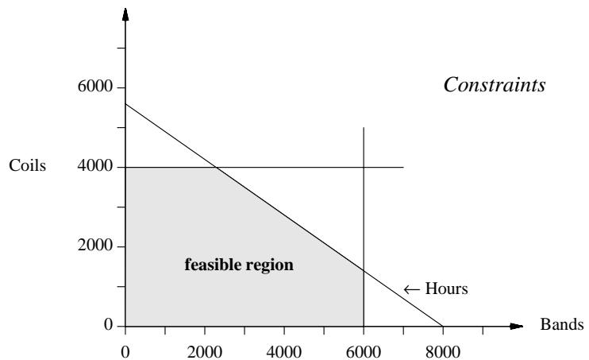
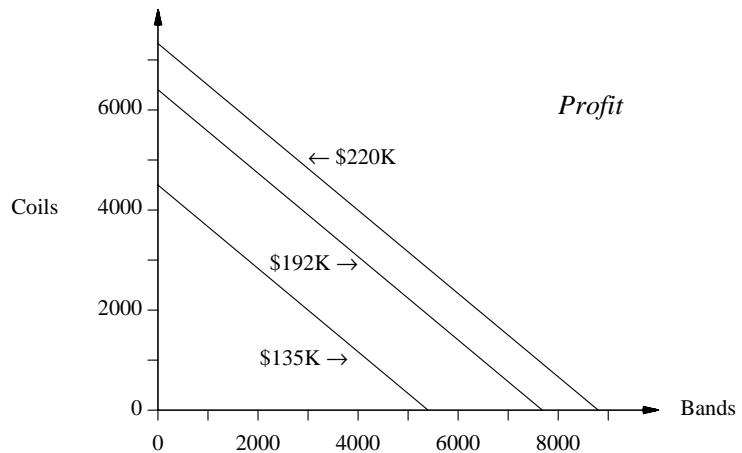
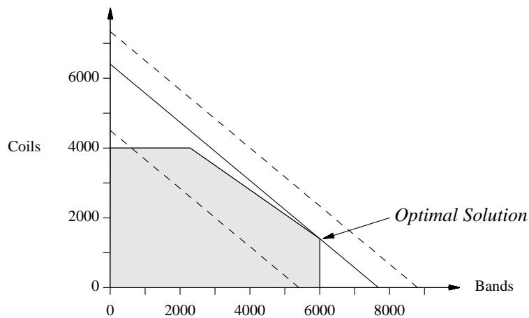

# 一、生产模型：利润最大化

正如我们在引言中所述，数学规划 (Mathematical Programming) 是一种用于解决某些类型问题的技术——特别是利润 (profit) 最大化和成本最小化问题——这些问题通常受到资源、产能、供应、需求等约束 (con) 条件的限制。AMPL 是一种用于表述此类优化问题的语言。它提供了一种代数模型 (algebraic model) 表示法，非常接近于你用数学方式描述问题的方式，因此能够轻松地从熟悉的数学描述转换为 AMPL。

我们将首先关注线性规划 (Linear Programming, LP)，这是最著名且最简单的形式；本书后续章节将介绍其他类型的数学规划。本章讨论线性规划最常见的应用之一：在生产能力受限的情况下，使某一操作的利润最大化。第 2 章和第 3 章专门讨论另外两种同样常见的线性规划问题，第 4 章则展示如何复制和组合线性规划模型以生成真正的大规模问题。这些章节是为初学者编写的，但数学规划的有经验实践者也会发现它们是了解 AMPL 的快速入门资料。

我们从一个只有两个决策变量的线性规划 (linear program, LP) 开始，该问题源自一个虚构的炼钢操作。这将快速回顾线性规划，如果你已有一些经验，可以刷新记忆，或者如果你刚开始学习，也能帮助你入门。我们将展示同一个 LP 如何表示为一个通用的生产代数模型，以及具体的数据。然后我们将展示如何在 AMPL 中表达几个线性规划问题，以及如何运行 AMPL 和求解器 (solver) 来产生解。

模型和数据的分离是用简洁且易懂的方式描述更复杂的线性规划的关键。本章的最后一个例子通过展示对模型的几项改进来说明这一点。

# 1.1 一个两变量线性规划

一家 (极度简化的) 钢铁公司必须决定如何分配下辊轧机 (rolling mill) 的时间。该机以未完成的钢坯为输入，可以生产两种半成品，我们称之为钢带 (bands) 和钢卷 (coils)。(术语并非完全标准；有关钢铁生产中现实线性规划应用的一些说明，请参见本章末尾的参考文献。) 轧机的两种产品以不同的速率下线：

```txt
每小时吨数：    钢带    200
               钢卷    140
```

并且它们的盈利能力也不同：

```txt
每吨利润：    钢带    $25
             钢卷    $30
```

为了进一步复杂化问题，以下每周生产量是在当前已订货量基础上可以证明的最高产量：

```txt
每吨利润：    钢带    6,000
             钢卷    4,000
```

公司面临的问题如下：如果本周有 40 小时的生产时间可用，那么应生产多少吨钢带和多少吨钢卷才能带来最大的总利润 (profit)？

虽然我们得到了生产率和单位利润的数值，但需要生产的带钢和线圈的吨数尚属未知。这些数量是决策变量 (variable)，我们必须确定其值以最大化利润。线性规划 (linear program) 的目的是将利润和生产限制表示为包含变量的显式公式，从而系统地确定变量的所需值。

在线性规划的代数表述中，通常使用数学简写来表示变量。因此，我们将用 $X_B$ 表示要生产的带钢吨数，用 $X_C$ 表示线圈吨数。生产所有这些吨位所需的总小时数为：

$$
\text{(生产一吨带钢所需小时数)} \times X_B + \text{(生产一吨线圈所需小时数)} \times X_C
$$

这个数字不能超过可用的 40 小时。由于每吨小时数是上述每小时吨数的倒数，我们得到了变量的约束：

$$
(1 / 200) X_B + (1 / 140) X_C \leq 40.
$$

还有生产限制：

$$
\begin{aligned}
0 \leq X_B \leq 6000 \\
0 \leq X_C \leq 4000
\end{aligned}
$$

在上述问题的陈述中，指定了上限，但下限是假设的——很明显，带钢或线圈的负生产是没有意义的。然而，在处理计算机问题时，必须非常明确。

通过与总工时公式的类比，总利润必须是。也就是说，我们的目标是最大化 $25X_B + 30X_C$。将这些综合在一起，我们得到以下线性规划：

$$
\begin{array}{r l}\displaystyle
\text{Maximize} & 25 X_B + 30 X_C \\
\text{Subject to}
& (1 / 200)X_B + (1 / 140)X_C \leq 40 \\
& 0 \leq X_B \leq 6000 \\
& 0 \leq X_C \leq 4000 \\
\end{array}
$$

这是一个非常简单的线性规划，因此我们将用手动方式解决它，并用 AMPL 验证答案。

首先，通过将每吨利润乘以每小时吨数，我们可以确定每种产品每小时的利润：

```txt
每小时利润：    带钢    $5,000 
               线圈    $4,200
```

显然，带钢是更有效的轧时利用方式，因此为了最大化利润，我们应该尽可能多地生产带钢——6,000 吨，这需要 30 小时。然后我们应该用剩下的 10 小时来生产 线圈——总共 1,400 吨。利润是 \$25 乘以 6,000 吨加上 \$30 乘以 1,400 吨，总共是 \$192,000。

或者，由于只有两个变量，我们可以用图形方式表示可能性。如果 $X_B$ 值绘制在水平轴上，$X_C$ 值绘制在垂直轴上，每个点代表决策变量的一个值选择，或一个解：



水平线代表线圈的生产上限，垂直线代表带钢的生产上限。对角线是工时约束；该线上的每个点代表带钢和线圈的一个组合，恰好需要 40 小时的生产时间，而该线向下和向左的任何点需要少于 40 小时。

由轴和这三条线界定的阴影区域恰好对应于可行解 —— 那些满足所有三个约束的解。在该区域中表示的所有可行解中，我们寻找能最大化利润的那个解。

对于这个问题，斜率为 $-25/30$ 的线代表产生相同利润的组合；例如，在下图中，从 (0, 4500) 到 (5400, 0) 的线代表产生 $135,000 利润的组合。不同的利润在图中给出不同但平行的线，更高的利润给出更高且更靠右的线。



如果我们将这两个图结合起来，可以看到利润最大化或最优的可行解：



利润等于 \$ 135,000 的线段部分位于可行域内；该线段上且在可行域内的任意一点都对应一个能够实现 \$ 135,000 利润的解。另一方面，利润为 \$ 220,000 的线完全不与可行域相交；这说明我们无法实现高达 \$220,000 的利润。从这个角度来看，求解线性规划问题就转化为回答以下问题：在所有与可行域相交的利润线中，哪一条是最高的且最靠右的？答案是中间那条线，它刚好在某个角点处与可行域相切。该点对应 6,000 吨带钢和 1,400 吨线圈，利润为 $ 192,000——这与我们之前得到的结果一致。

# 1.2 AMPL 中的两变量线性规划

使用 AMPL 求解此线性规划问题可以非常简单，只需将 AMPL 对该线性规划的描述

```ampl
var XB; var XC;
maximize Profit: 25 * XB + 30 * XC;
subject to Time: (1/200) * XB + (1/140) * XC <= 40;
subject to B_limit: 0 <= XB <= 6000;
subject to C_limit: 0 <= XC <= 4000;
```

输入到一个文件中——例如命名为 prod0.mod，然后输入几条 AMPL 命令即可：

```ampl
ampl: model prod0.mod;
ampl: solve;
MINOS 5.5: optimal solution found.
2 iterations, objective 192000
ampl: display XB, XC;
XB = 6000
XC = 1400
ampl: quit;
```

AMPL 会话的调用方式和外观取决于你的操作系统环境和界面，但你始终可以选择在 `ampl:` 提示符后输入 AMPL 语句，直到输入 ***quit*** 命令退出 AMPL。（在本书中，所有你输入的内容均以 ***像这样的斜体字*** 显示。）

你输入到文件中的 AMPL 线性规划在各个方面都与代数形式相对应。它指定了决策变量，定义了目标函数，并列出了约束条件。其主要区别在于格式更加正式和规范，以便于计算机处理。每个变量在 `var` 语句中命名，每个约束则由以 `subject to` 开头并带有约束名称（如 `Time` 或 `B_limit`）的语句定义。乘法需要显式的 `*` 运算符，$\leq$ 关系则写作 `<=`。

在你的 AMPL 会话中，第一条命令 `model prod0.mod` 会将文件读入 AMPL，效果等同于你在 `ampl:` 提示符后逐行输入内容。接下来你只需输入 `solve` 命令，AMPL 就会翻译你的线性规划问题，将其发送给线性规划求解器，并返回答案。最后使用 `display` 命令来显示变量的最优值。

求解命令后面的 `MINOS 5.5` 消息表明 AMPL 使用了名为 MINOS 的求解器的 5.5 版本。我们在本书的示例中使用了 MINOS 和其他几种求解器。你的计算机上可能安装了不同的求解器集合，但对于一个线性规划问题，任何求解器都应给出相同的最优目标值。然而，通常存在多个解都能达到最优目标值，在这种情况下，不同的求解器可能会报告变量的不同最优值。 (选择和控制求解器的命令将在第 11.2 节中解释。)

运行 AMPL 的步骤可能因计算机和操作系统的不同而有所差异。详细信息请参见随你的 AMPL 软件版本附带的补充说明，而不是本书。对于后续的示例，我们假设 AMPL 已经启动，并且你已看到第一个 `ampl:` 提示符。如果你使用的是图形界面的 AMPL，例如 第 1.7 节 中简要提到的那些界面之一，则许多 AMPL 命令可能具有等效的菜单或对话框选项。你仍然可以选择按本书所示方式输入命令，但你可能需要打开某种“命令窗口”才能看到提示符。

# 1.3 一个线性规划模型

到目前为止，本章采用的简单方法有助于理解线性规划的基础知识，但你可以看出，如果我们的实际问题稍微更复杂一些——例如增加几种产品、增加几个约束条件——那么写出这个模型就会变得很麻烦，并且无法用图形加以说明。如果这个问题在形式上或仅仅是数据值上经常变化，那么更新起来也会很困难。

如果我们想超越最简单的线性规划问题，就必须采用更通用、更简洁的方式来表达它们。这时数学符号就派上用场了。我们可以使用代数符号写出问题的一般形式的紧凑描述，我们称之为模型 (model)，包括目标函数和约束条件的代数表示。图 1-1 展示了用代数符号表示的生产问题。

图 1-1 是一个符号化的线性规划模型。其组成部分对所有模型都是基本的：

- **集合**，如产品集合；
- **参数**，如生产率和利润率；
- **变量**，其值由求解器确定；
- **目标函数**，需最大化或最小化；
- **约束条件**，解必须满足这些条件

> 给定：
> 
> - $P$：产品集合  
> - $a_{j} =$ 每小时生产产品 $j$ 的吨数，对每个 $j\in P$  
> - $b =$ 工厂可用的总工时  
> - $c_{j} =$ 每吨产品 $j$ 的利润，对每个 $j\in P$  
> - $u_{j} =$ 产品 $j$ 的最大生产吨数，对每个 $j\in P$
> 
> 定义变量：
> 
> $X_{j} =$ 要生产的每种产品 $j$ 的吨数，对每个 $j \in P$
> 
> 最大化：$\sum_{j \in P} c_j X_j$
> 
> 约束条件：
> 
> - $\sum_{j \in P} \frac{1}{a_j} X_j \leq b$  
> - $0 \leq X_j \leq u_j$ 对于每个 $j \in P$
> 
> 约束条件：$\sum_{j \in P} (1 / a_j) X_j \leq b$
> 
> $0 \leq X_j \leq u_j$，对于每个 $j \in P$
> 
> 图 1-1：代数形式的基本生产模型。

该模型描述了无穷多个相关的优化问题。然而，如果我们为数据提供具体值，则该模型将成为一个可以求解的特定问题或模型实例。每组不同的数据值定义了一个不同的实例；上一节中的示例就是这样一个实例。

看起来我们似乎使事情变得不那么简洁，因为我们的模型比第 1.1 节中线性规划的原始陈述更长。然而，请考虑如果集合 $P$ 包含 42 个产品而不是 2 个产品会发生什么。线性规划将增加 120 个数据值（$a_j$、$c_j$ 和 $u_j$ 各 40 个）；将增加 40 个变量，每个变量都有新的下限和上限；目标函数和时间约束中将增加 40 项。然而，上述抽象模型将没有任何不同。如果没有这种短模型描述长线性规划的能力，更大、更复杂的线性规划实例将变得无法处理。

像这样的数学模型通常是简洁性和可理解性之间的最佳折衷；而且幸运的是，它很容易转换为计算机可以处理的语言。从现在开始，我们将假设模型以代数形式给出。然而现实往往并不那么简单，因此大多数模型将具有更多的集合、参数和变量，以及更复杂的目标和约束。实际上，在任何真实情况下，构建正确的模型并提供准确的数据都是最困难的任务；而求解特定问题只需要一个求解器和足够的计算能力。

# 1.4 AMPL 中的线性规划模型

现在我们可以讨论 AMPL。AMPL 语言有意尽可能接近数学形式，同时仍然便于在普通键盘上输入并便于程序处理。对于上面列出的每个基本组成部分——集合、参数、变量、目标和约束——都有相应的 AMPL 构造，并且有编写算术表达式、集合求和等的方法。

我们首先给出一个尽可能接近代数模型的 AMPL 模型，然后展示一个更好地利用语言特性的改进版本。

### 基本模型

对于图 1-1 所示的基本生产模型，直接翻译成 AMPL 的形式如图 1-2 所示。

```ampl
set P;  
param a {j in P};  
param b;  
param c {j in P};  
param u {j in P};  
var x {j in P};  
maximize Total_Profit: sum {j in P} c[j] * X[j];  
subject to Time: sum {j in P} (1/a[j]) * X[j] <= b;  
subject to Limit {j in P}: 0 <= X[j] <= u[j];
```

图 1-2：AMPL 中一个基本的生产模型 (文件 `prod.mod`)

关键字 `set` 声明一个集合名称，例如

```ampl
set P;
```

集合 $P$ 的成员将在单独的数据语句中提供，我们稍后将展示。

关键字 `param` 声明一个参数，该参数可以是一个标量值，例如

```ampl
param b;
```

也可以是由集合索引的一组值。当使用代数记号表示“对于集合 $P$ 中的每一个 $j$ 都有一个 $a_j$”时，在 AMPL 中写作：

```ampl
param a {j in P};
```

这表示 `a` 是一组参数值的集合，每个值对应于集合 $P$ 的一个成员。在代数记号中使用的下标，在 AMPL 中需要用方括号表示；因此，单个值如 $a_j$ 应写作 `a[j]`。

声明 `var x {j in P};` 表示一组变量，每个变量对应于集合 $P$ 中的一个成员，这些变量的值将由求解器（solver）确定。

目标函数通过如下声明给出：

```ampl
maximize Total_Profit: sum {j in P} c[j] * x[j];
```

名称 `Total_Profit` 是任意选取的；语法上要求必须有一个名称，但具体使用哪个名称并无限制。求和运算符 `sum` 的优先级低于乘法运算符 (`*`)，因此上述表达式确实表示一个乘积的和，符合预期。

最后，约束条件如下所示：

```ampl
subject to Time: sum {j in P} a[j] * x[j] <= b;
subject to Limit {j in P}: 0 <= x[j] <= u[j];
```

时间约束 `Time` 表示集合 `P` 上的某一加权和不能超过参数 `b` 的值。而限制约束 `Limit` 实际上是一组约束，每个 `P` 中的 `j` 对应一个：即每个 `x[j]` 被限制在 0 和对应的 `u[j]` 之间。

构造式 `{j in P}` 被称为 *索引表达式 (indexing expression)*。正如示例所示，索引表达式不仅用于声明参数和变量，还用于任何代数模型中需要对“每个 $j \in P$”执行操作的地方。因此，声明限制约束是因为我们希望对集合 $P$ 中每个不同的产品 $j$ 施加不同的限制 $0 \leq \mathbb{X}[j] \leq \mathbb{U}[j]$。同样地，目标函数中的求和表达式是为了表明在计算利润时，需将集合 $\mathbb{P}$ 中每个 $j$ 对应的不同项 $\mathsf{c}[\mathsf{j}] \star \mathsf{X}[\mathsf{j}]$ 相加。

AMPL 模型的布局非常自由。集合、参数和变量必须在使用前声明，除此之外可以以任意顺序出现。语句以分号结尾，并可跨行书写以增强可读性。大小写字母被视为不同字符，因此 `time`、`Time` 和 `T1ME` 是三个不同的名称。

你可能已经注意到，传统数学记号在 AMPL 中被调整以适应普通键盘和字符集的限制。例如，AMPL 使用单词 `sum` 而不是符号 $\Sigma$ 来表示求和，使用 `in` 而不是 $\in$ 表示集合成员关系。集合的定义用花括号括起来，如 $\{j \text{ in } \mathbb{P}\}$。当数学记号通过相邻排列表示乘法时（如 $c_j x_j$），AMPL 使用大多数编程语言中的乘法运算符 `*`，并使用方括号表示下标，因此 $c_j x_j$ 在 AMPL 中写作 `c[j] * x[j]`。

你会发现 AMPL 的其余部分也很类似 —— 多了几个算术运算符，多了几个关键字（如 sum 和 in），还有更多指定索引表达式的方式。像其他任何计算机语言一样，AMPL 有精确的语法，但我们在这里不会过分强调这些规则；大多数规则会在我们继续学习时变得清晰，完整的细节在参考手册附录 A 中给出。

我们最初的两变量线性规划是 图 1-2 模型的众多 LP 实例之一。要指定它或任何其他这样的实例，我们需要提供

  
图 1-3：生产模型数据（文件 prod.dat）。

集合 $\mathbb{P}$ 的成员以及各个参数的值。在代数记号中没有标准的方式来描述这些数据值；通常使用某种非正式的表格，比如我们之前展示的那些。在 AMPL 中，数据表格有特定的语法，这种语法足够规范且无歧义，可以被计算机翻译。图 1-3 以这种形式给出了基本生产模型的数据。一个 set 语句提供了集合 $\mathbb{P}$ 的成员（带钢 和 线圈），一个 param 表格给出了 a、c 和 u 的对应值。一个简单的 param 语句给出了 b 的值。这些数据语句在第 9 章中有详细描述，它们有多种选项，可让你以方便的方式列出或制表参数。

# 一个改进的模型

我们可以立即继续求解由 图 1-2 和 图 1-3 定义的线性规划。然而，一旦我们用 AMPL 编写了模型，就不必拘泥于代数的所有惯例，而是可以考虑一些可能使模型更易于使用的更改。图 1-4a 和 图 1-4b 展示了一个可能的“改进”版本。集合、参数和变量的简短“数学”名称已被更长、更有意义的名称所取代。索引表达式变成了 $\{\mathbb{P}$ in PROD$\}$，或者在那些不使用索引 $\mathbb{P}$ 的声明中简化为 $\{\mathbb{P}$。变量的边界被放在它们的 var 声明内，而不是作为单独的约束；类似的边界也被放在参数上，以表明在从模型导出的任何有意义的线性规划中必须为正或非负的参数。

最后，添加了注释来帮助读者理解模型。注释以 # 开头，在行尾结束。像任何编程语言一样，合理使用有意义的名称、注释和格式有助于使 AMPL 模型更易读和理解。

总有多种方式在 AMPL 中描述特定模型。由建模者选择看起来最清晰或最方便的方式。我们之前的数学方法通常更受青睐，因为它可以快速处理熟悉的模型。另一方面，第二个版本对于将在数月或数年内由多人维护和修改的模型更具吸引力。

set PROD; # 产品  
param rate {PROD} > 0; # 每小时生产的吨数  
param avail >= 0; # 每周可用的小时数  
param profit {PROD}; # 每吨利润  
param market {PROD} >= 0; # 每周销售吨数的上限  
var Make {p in PROD} >= 0, <= market[p]; # 生产量[p]  
maximize Total_Profit: sum {p in PROD} profit[p] * Make[p]; # 目标：所有产品的总利润  
subject to Time: sum {p in PROD} (1/rate[p]) * Make[p] <= avail; # 约束：所有产品使用的总时间不得超过可用时间  

set PROD := bands coils;  
param: rate profit market :=  
bands 200 25 6000  
coils 140 30 4000;  
param avail := 40;

如果我们把所有模型声明放进一个名为 `steel.mod` 的文件中，并把数据说明放进名为 `steel.dat` 的文件中，那么像之前一样，只需输入几条语句就可以求解并显示结果：

```yaml
ampl: model steel.mod;  
ampl: data steel.dat;  
ampl: solve;  
MINOS 5.5: optimal solution found.  
2 iterations, objective 192000  
ampl: display Make;  
Make [*] :=  
bands 6000  
coils 1400;  
```

`model` 和 `data` 命令分别指定要读取的文件，在这个例子中是从 `steel.mod` 读取模型，从 `steel.dat` 读取数据。使用两个读取文件的命令有助于清晰地分离模型与数据。

文件名可以是操作系统所识别的任意格式；AMPL 不会检查其正确性。本书中出现的文件名均指可在 AMPL 网站及其他 AMPL 发行版中获取的示例文件。

模型求解完成后，我们可以通过输入 `display Make` 来显示所有变量 `Make[p]` 的 最优解。`display` 的输出格式与 AMPL 数据输入格式一致，因此只需掌握一套格式。（其中 `[*]` 表示具有单一下标的变量或参数。对于输入而言并非必需，因为 `Make` 是一维的，但 `display` 会打印出来以作提示。）

# 捕捉错误

在开发模型时，难免会出错。AMPL 能检测到各种不正确的语句，并在 `model`、`data` 或 `solve` 命令之后以错误信息的形式报告。

AMPL 在读取模型时即可发现许多错误。例如，如果你在声明变量 `Make` 的上下界时使用了错误的语法，则会在输入 `model` 命令后立即收到如下错误信息：

```
steel.mod, line 8 (offset 250): syntax error  
context: var Make {p in PROD} >>> 0 <<< <= Make[p] <= market[p];  
```

如果你在表达式如 `profit[p] * make[p]` 中错误地使用了小写 `make` 而非 `Make`，则会收到如下信息：

```
steel.mod, line 11 (offset 339): make is not defined  
context: maximize Total_Profit: sum {p in PROD} profit[p] * >>> make[p] <<< ;  
```

在每种情况下，出错的行都会被打印出来，错误的大致位置由 `>>>` 和 `<<<` 标记出。

其他常见的错误信息来源包括：模型组件在声明之前被使用、命令末尾缺少分号，或在错误的上下文中使用了保留字（如 `sum` 或 `in`）。（A.1 节包含保留字列表。）数据语句中的语法错误也会在你输入 `data` 命令后立即报告。

数据值中的错误会在你输入 `solve` 命令后被捕获。例如，如果工时数被输入为 `-40`，你将看到：

```
ampl: model steel.mod;  
ampl: data steel.dat;  
ampl: solve;  
Error executing "solve" command:  
error processing param avail:  
failed check: param avail = - 40  is not >= 0;
```

在模型中尽可能多地包含有效性检查是一种良好的做法，这样可以在早期阶段就发现错误。

尽管你已尽最大努力正确构建模型并包含数据有效性检查，有时一个不产生任何错误信息且能从求解器 (solver) 得到“最优解”(optimal solution) 报告的模型，仍可能产生明显错误或无意义的解。例如，所有产品的生产水平都为零，或者单位工时利润较低的产品反而以更高的产量生产。在这种情况下，你可能需要花一些时间回顾你的模型公式，才能发现问题所在。

expand 命令可以通过显示 AMPL 如何实例化你的符号模型来帮助你查找错误。例如，要查看 AMPL 为目标函数 Total_Profit 生成的内容，你可以输入：

```python
ampl: expand Total_Profit;
maximize Total_Profit:
    25*Make['bands'] + 30*Make['coils'];
```

这与我们在 1.1 节中显式写出的公式直接对应。展开约束的方式类似：

```python
ampl: expand Time;
subject to Time:
    0.005*Make['bands'] + 0.00714286*Make['coils'] <= 40;
```

符号模型中的表达式（如此例中的系数 1/rate[p]）在显示展开结果之前会被求值。你可以单独输入 expand 来展开目标函数和所有约束。

以上表达式显示了符号模型中的 Make[j] 是如何展开为显式变量 Make['bands'] 和 Make['coils'] 的。你可以在 AMPL 命令中使用类似的表达式，例如展开某个特定变量以查看它在目标函数和约束中的系数：

```python
ampl: expand Make['coils'];
Coefficients of Make['coils']:
    Time 0.00714286
    Total_Profit 30
```

下标可以使用单引号 (') 或双引号 (") 包围。

# 1.5 为模型添加下界

一旦模型和数据已经设置好，对其进行修改并重新求解是一件很简单的事。实际上，我们不会期望在线性规划 (LP) 应用中遇到模型和数据只准备并求解一次，甚至只求解几次的情况。通常，在模型开发过程中会引入许多改进，而数据的更改会一直持续到模型不再使用为止。

让我们以几个变化和改进的例子结束本章。这些例子也突出了 AMPL 的一些附加功能。

假设我们首先添加另一种产品，钢板 (steel plate)。模型保持不变，但在数据中我们必须将 plate 添加到集合 PROD 的成员列表中，并且必须为 plate 添加一行参数值：

```ampl
set PROD :  =  bands coils plate;
param rate profit market :  =  
bands 200 25 6000
coils 140 30 4000
plate 160 29 3500 ;
param avail :  =  40;
```

我们将这个版本的数据放在一个名为 steel2. dat 的文件中，并像以前一样使用 AMPL 来获得解：

```ampl
ampl: model steel.mod;
data steel2. dat;
solve;
MINOS 5.5: optimal solution found.
2 iterations, objective 196400

ampl: display Make;
Make  [*] :=
bands 6000
coils 0
plate 1600
;
```

与两个变量的版本相比，利润有所增加，但目前最好完全不生产 coils！经过仔细检查，这个结果并不令人惊讶。Plate 每小时产生 $4640 的利润，虽然低于 bands，但高于 coils。因此，在 bands 未达到其市场限制之前，plate 会被用来吸收剩余的产能；只有当 bands 和 plate 都达到其市场限制后，才会考虑生产 coils。

实际上，不能仅仅为了增加每周利润而完全关闭一条产品线。在模型中最简单地反映这一点的方法是为生产量添加下限，如图 1-5a 和图 1-5b 所示。我们声明了一个新的参数集合 commit，用于表示由销售承诺所施加的生产下限，并将变量 Make[p] 的声明中 $>= 0$ 修改为 $>=$ commit[p]。

在做出这些更改后，我们可以再次运行 AMPL 以获得更现实的解决方案：

```
ampl: model steel3.mod;
data steel3.dat;
solve;
MINOS 5.5: optimal solution found.
2 iterations, objective 194828.5714

ampl: display commit, Make, market;
:  commit   Make    market :=
bands   1000    6000    6000
coils   500     500     4000
plate   750     1028.57 3500 ;
```

为了便于比较，我们在实际生产量 Make 的两侧显示了 commit 和 market。如预期的那样，在满足承诺后，最有利可图的做法是

```ampl
set PROD;  # 产品
param rate {PROD} > 0;  # 每小时生产的吨数
param avail >= 0;  # 每周可用的小时数
param profit {PROD};  # 每吨利润
param commit {PROD} >= 0;  # 每周销售吨数的下限
param market {PROD} >= 0;  # 每周销售吨数的上限
var Make {p in PROD} >= commit[p], <= market[p];  # 生产的吨数
maximize Total_Profit: sum {p in PROD} profit[p] * Make[p];  # 目标函数：所有产品的总利润
subject to Time: sum {p in PROD} (1/rate[p]) * Make[p] <= avail;  # 约束：所有产品使用的总小时数不得超过可用小时数
```

```ampl
集合 PROD := bands coils plate；
param:  rate  profit  commit  market :=
bands   200   25      1000    6000
coils   140   30      500     4000
plate   160   29      750     3500；
param avail := 40；
```

生产 bands 至其市场限制量，然后利用剩余的可用时间生产 plate。

# 1.6 向模型中添加资源约束

钢坯的加工不是一个单一的操作，而是可能以不同速率进行的一系列步骤。为了激发一个更通用的模型，假设我们将生产分为一个加热阶段（可以以每小时 200 吨的速度处理进来的钢坯）和一个轧制阶段（以先前给出的速率生产 bands、coils 或 plate）。进一步假设只有 35 小时的加热时间，尽管有 40 小时的轧制时间。

为了涵盖这种情况，我们可以在模型中添加一个生产阶段的集合 `STAGE`。参数和约束声明也相应修改，如图 1-6a 所示。由于每个阶段可能有不同的可用小时数，参数 `avail` 现在按 `STAGE` 索引。由于每个产品在每个阶段可能有不同的生产速率，参数 `rate` 按 `PROD` 和 `STAGE` 索引。在时间约束中，产品 p 在阶段 s 中的生产速率被称为 `rate[p,s]`；这是 AMPL 对代数符号中像 $a_{ps}$ 这样的双重下标实体的版本。

唯一其他的更改是约束声明，我们不再有一个单一的约束，而是每个阶段有一个约束，由该阶段的有限时间所施加。用代数符号表示，这可能被写成

比较 AMPL 版本：

```ampl
subject to Time {s in STAGE}:
   sum {p in PROD} (1/rate[p,s]) * Make[p] <= avail[s];
```

像其他例子一样，这是一个直接的类比，适应了计算机语言的要求。在几乎所有的模型中，大多数约束都是像这样的索引集合。

由于 `rate` 现在按两个索引的组合索引，它需要一个独立的数据表，如图 1-6b 所示。数据文件还必须包括新集合 `STAGE` 的成员资格，以及加热和轧制的 `avail` 值。

做出这些更改后，我们使用 AMPL 得到另一个修订的解决方案：

```
ampl: reset;
ampl: model steel4.mod;
ampl: data steel4.dat;
ampl: solve;
MINDS 5.5: optimal solution found.
4 iterations, objective 190071.4286
```

  
图 1-6b：附加资源约束的数据 (`steel4.dat`)。


`reset` 命令会清除之前的模型，以便读入新模型。

在上面示例的末尾，我们显示了与 `Time` 约束相关的“边际值”（也称为“对偶值”或“影子价格”）。约束的边际值用于衡量当该约束放松一小部分时目标函数值会改善多少。例如，在这里我们预计在某种程度上，额外的再加热时间每小时将带来另外 \$1800 的利润，而额外的轧制时间每小时将带来 \$3200 的利润；反之，减少这些时间也会相应地减少利润。在 `display` 这类输出命令中，AMPL 会将约束的名称解释为对应的边际值。

我们还显示了与变量 `Make` 相关的几个量。首先是下界 `Make.lb` 和上界 `Make.ub`，在本例中它们与 `commit` 和 `market` 相同。我们还展示了“约简成本”`Make.rc`，它与边际值之于约束的意义相同，都是相对于边界而言的。因此我们看到，在某种程度上，每增加一吨卷钢产量的下界（或承诺量），利润将减少约 \$1.86；每减少一吨下界，利润将增加约 \$1.86。带钢和钢板的生产水平介于其上下界之间，因此它们的约简成本基本上为零（注意 `e-15` 表示 $\times 10^{-15}$），改变其生产水平将不会产生影响。

  
图 1-7a：基于 Java 的 AMPL 图形用户界面 (`Macintosh`)。

与我们之前的会话相比，可以看出附加的再加热时间限制使利润减少了约 \$4750，并迫使最优解发生显著变化：钢板产量大幅增加，而带钢产量降低。此外，最优解背后的逻辑不再那么显而易见。正是由于仅凭逻辑推理难以解决线性规划问题，因此才需要像 AMPL 这样的基于计算机的系统。

# 1.7　AMPL 接口

到目前为止我们所展示的示例都使用了 AMPL 的命令行界面：用户输入文本命令，系统返回文本结果。在本书中，我们将始终使用这一界面来演示 AMPL 的功能。它允许访问 AMPL 所有丰富的功能，并且在所有环境中保持一致。基于文本的界面最适合创建常用命令的脚本，以及编写使用 AMPL 编程结构的程序（详见第 13 章）。在某些应用中，AMPL 是某个更大流程中隐藏或后台的一部分，此时也会使用文本命令。

  
图 1-7b：基于 Tcl/Tk 的 AMPL 图形用户界面（Unix）。

尽管如此，图形用户界面在许多时候可以让程序更易于使用，帮助初学者快速上手，并让偶尔或不频繁使用的用户更容易回忆起细节。AMPL 也不例外。因此，目前已有多种 AMPL 的图形用户界面，它们与传统编程语言的“集成开发环境”大致相似，但 AMPL 的环境要简单得多。典型的 AMPL 图形界面通常提供简便的方式执行标准命令、设置选项、调用求解器并显示结果，通常只需点击按钮和选择菜单项，而无需手动输入命令。

这些界面支持主流的操作系统平台。例如，图 1-7a 展示了一个基于 Java 的简单界面，可在 Unix、Linux、Windows 和 Macintosh 上运行，在各平台上外观基本一致。（图中显示的是 Mac 界面。）图 1-7b 展示了一个类似的基于 Tcl/Tk 的界面，运行于 Unix 系统，但也兼容 Windows 和 Macintosh。图 1-7c 展示了另一个使用 Visual Basic 创建并运行于 Windows 上的界面。

此外，还有一些基于网页的界面，通过网络连接提供对 AMPL 或求解器的客户端-服务器访问，以及多种应用程序接口（API），可用于从其他程序中调用 AMPL。有关所有可用界面的最新信息，请访问 AMPL 官方网站 www.ampl.com。

  
图 1-7c：基于 Visual Basic 的 AMPL 图形用户界面（Windows）。

# 参考文献

[1] 朱利叶斯·S·阿罗诺夫斯基、约翰·M·达顿、迈克尔·T·塔亚布汗。《Process Industry Operations: Linear Programming Management Planning》。约翰·威利父子出版社（纽约州纽约市，1978 年）。本书详细介绍了多种利润最大化应用，重点涉及石油和石化工业。

[2] 瓦塞克·查瓦塔尔。《Linear Programming》。W. H. 弗里曼公司（纽约州纽约市，1983 年）。一本简洁而经济的线性规划理论与算法主题入门书籍。

蒂博尔·法比安, “钢铁一体化生产的线性规划模型”。《管理科学》, 1958 年第 4 期, 第 415–449 页。这是早期线性规划应用的一个案例，涵盖了从煤炭和矿石到最终产品的钢铁生产全过程。

罗伯特·弗勒 与 高塔姆·杜塔, “数学规划在综合钢铁厂中的应用综述”。《制造与服务运营管理》, 2001 年第 4 期, 第 387–400 页。

大卫·A·肯德尔、亚历山大·米尔豪斯 与 海梅·阿拉托雷, 《钢铁行业的投资计划规划》。约翰霍普金斯大学出版社 (巴尔的摩, 马里兰州, 1984 年)。本书通过墨西哥钢铁工业的实例，提供了多个详细的数学规划模型。

罗伯特·J·范德贝, 《线性规划：基础与扩展》(第 2 版)。克鲁韦尔学术出版社 (荷兰 多德雷赫特, 2001 年)。这是一本关于线性规划理论与方法的最新综述著作。

# 练习

1-1. 本练习从一个与第 1.1 和 1.2 节结构类似的两变量线性规划问题开始，但其背后的故事却截然不同。

(a) 你负责一个新产品的广告宣传活动，预算为 100 万美元。你可以在电视或杂志上做广告。一分钟电视广告费用为 2 万美元，可以覆盖 180 万潜在客户；一页杂志广告费用为 1 万美元，可以覆盖 100 万潜在客户。你必须至少预订 10 分钟的电视广告时间。你应该如何分配预算以最大化受众数量？请使用 AMPL 建立该问题的模型并求解。使用第 1.1 节中描述的至少一种方法手动验证你的解。

(b) 制作有效的广告需要创意才能；在你的组织中，制作一页杂志广告需要三个人周 (person-weeks) 的时间，制作一分钟电视广告需要一个人周的时间。你只有 100 个人周的时间可用。将这一约束加入模型，并确定你应该如何重新分配预算。

(c) 广播广告每分钟可以覆盖 25 万观众，费用为每分钟 2000 美元，并且只需要一个人日的时间。这种媒体形式如何影响你的解决方案？

(d) 如果你必须至少预订两页杂志广告，或者最多只能使用 120 分钟的广播广告，你的解会如何变化？

1-2. 本章的钢铁模型可以进一步修改以反映生产需求的各种变化。对于以下每一部分，请说明为了实现所需变化，需要对图 1-6a 和图 1-6b 进行哪些修改。（请分别进行每项修改，而不是将前一部分的修改累积到下一部分。）

(a) 你将如何修改约束条件，使得所有产品使用的总工时必须等于每个阶段可用的总工时？使用这一修改后的模型求解线性规划，并验证你是否得到了相同的结果。解释为什么在这种情况下，解没有发生变化。

(b) 如何在模型中增加一个限制，使所有产品的总重量小于一个新的参数 max_weight？当重量限制为 6500 吨时，求解该线性规划，并解释这个额外的限制如何改变了结果。

(c) 轧机管理人员的激励制度可能倾向于鼓励他们尽可能多地生产吨位。你将如何更改目标函数以最大化总吨位？对于本例的数据，这是否对最优解产生影响？

(d) 假设我们不使用模型中 commit[p] 表示的下界，而是要求每种产品占总生产吨位的一定比例。在图 1-1 的代数表示法中，这个新约束可以表示为

$$
X_{j}\geq s_{j}\sum_{k\in P}X_{k},\mathrm{~for~each~}j\in P
$$

其中 $s_j$ 是与产品 $j$ 相关的最低比例。你将如何修改 AMPL 模型以使用这个约束代替 commit[p] 下界？如果带钢和钢板的最低比例为 0.4，线圈为 0.1，解是什么？

验证如果你将最低比例更改为带钢和钢板为 0.5，线圈为 0.1，则线性规划给出的最优解是不生产任何产品，利润为零。解释为什么这是合理的。

(e) 假设只有钢板需要额外的精整工序，其容量为 20 小时，处理速率为每小时 150 吨。解释如何在不更改模型的情况下修改数据以纳入这一新工序。

1-3. 本练习涉及钢铁模型中的一些「敏感性」问题。

(a) 对于图 1-5a 和 1-5b 的线性规划，显示 Time 和 Make.rc。这些值告诉你关于解的哪些信息？（你可能希望回顾第 1.6 节中关于边际值和缩减成本的解释。）

(b) 解释为什么图 1-6a 中增加的均热时间约束会导致钢板产量增加而带钢产量减少。

(c) 使用 AMPL 验证以下陈述：如果将图 1-6b 数据中的可用均热时间从 35 增加到 36，则利润如第 1.6 节预测的那样增加 \$1800。如果均热时间进一步增加到 37，则利润再增加 \$1800。然而，如果均热时间增加到 38，则利润增加较少，进一步超过 38 的增加对最优利润完全没有影响。要将均热时间更改为例如 36 而不重新更改和读取数据文件，请键入命令

$$
\mathsf{let}\ \mathsf{avail}[\mathrm{"reheat"}] := 36;
$$

通过尝试一些其他的均热时间值，确认对于 35 到 $37\frac{1}{4}$ 小时之间的任何小时数，利润每增加一小时增加 \$1800，但超过 $37\frac{1}{4}$ 小时的均热时间增加不会带来任何进一步的利润。

绘制利润与可用均热小时数的关系图，小时数 $\geq 35$。

(d) 要找出 (c) 中利润与可用再加热时间关系图在任意特定再加热时间值处的斜率，只需查看 Time["reheat"] 的边际值即可。利用这一观察结果作为辅助，将 (c) 中的图像延伸至 25 小时的再加热时间。验证图像的斜率在再加热时间从 25 小时下降到不足 12 小时的过程中是否保持为每小时 6000 美元。解释当可用再加热时间降至 11 小时时会发生什么情况。

1-4. 这是一个类似的利润最大化模型，但背景不同。某汽车制造商生产多种汽车。每种汽车生产每辆车都需要一定的工厂时间，并产生一定的利润。下周已安排了一定数量的工厂时间，希望全部利用这些时间；但为了满足经销商需求，每种汽车至少需要生产一定数量。

(a) 定义这个问题的数据值有哪些？如何在 AMPL 中声明该问题的集合和参数值？决策变量是什么，如何在 AMPL 中声明它们？

(b) 假设目标是最大化总利润，如何在 AMPL 中为该问题声明目标函数？如何声明约束条件？

(c) 为了实验目的，假设有三种汽车，工厂中称为 T、C 和 L，共有 120 小时可用时间，每种汽车的每辆车所需时间、每辆车利润以及经销商订单如下：

<table><tr><td>汽车</td><td>时间</td><td>利润</td><td>订单</td></tr><tr><td>T</td><td>1</td><td>200</td><td>10</td></tr><tr><td>C</td><td>2</td><td>500</td><td>20</td></tr><tr><td>L</td><td>3</td><td>700</td><td>15</td></tr></table>

每种汽车应生产多少辆，最大利润是多少？你会发现解决方案中某一种汽车的数量是分数。在实际操作中，如何利用这个解决方案？

(d) 如果你最大化生产的汽车总数而不是总利润，会多生产多少辆车？利润会减少多少？

(e) 每种汽车都达到一定的燃油效率，制造商按法律要求必须保持一定的“车队平均”效率。车队平均效率的计算方法是：将每种汽车的效率乘以该种汽车的生产数量，将所有结果相加，然后除以所有生产的汽车总数。扩展你的 AMPL 模型，加入一个最小车队平均效率约束。如有必要，重新整理约束条件使其线性化——不能有变量被其他变量相除。

(f) 在汽车 T、C 和 L 的燃油效率分别为 50、30 和 20 英里/加仑的情况下，求出最优解，此时车队平均效率必须至少为 35 英里/加仑。解释这一变化如何影响生产数量和总利润。在这种情况下，处理解中的分数数量并不容易，你可能会怎么做？

如果你多获得 10 小时的生产时间，你可以获得更多利润。加入车队平均效率约束后，这额外的 10 小时是变得更有价值还是更没价值？

(g) 解释如何进一步改进该模型，以考虑不同生产阶段具有不同可用小时数的情况，类似于第 1.6 节中的钢铁模型。

1-5. 一群年轻的创业者通过从电子产品商店获取监管不力的物品并转售来获得（暂时）稳定的收入。每种物品都有街头价值、重量和体积；可获取的物品数量以及一次能处理的总重量和总体积都有限制。

(a) 建立一个 AMPL 模型，用于确定每天应获取每种物品的数量，以最大化一天的利润。

(b) 对下表给出的情况求解，

<table><tr><td></td><td>价值</td><td>重量</td><td>体积</td><td>可获取数量</td></tr><tr><td>电视</td><td>50</td><td>35</td><td>8</td><td>20</td></tr><tr><td>收音机</td><td>15</td><td>5</td><td>1</td><td>50</td></tr><tr><td>相机</td><td>85</td><td>4</td><td>2</td><td>20</td></tr><tr><td>CD 播放器</td><td>40</td><td>3</td><td>1</td><td>30</td></tr><tr><td>VCR</td><td>50</td><td>15</td><td>5</td><td>30</td></tr><tr><td>摄像机</td><td>120</td><td>20</td><td>4</td><td>15</td></tr></table>

重量限制为 500 磅，体积限制为 300 立方英尺。

(c) 假设希望获取每种物品的一部分，以始终有库存可供转售。此外，假设每种物品你能合理预期销售的数量存在上限。你将如何将这些条件加入模型？

(d) 该组织如何利用最大重量和最大体积约束的对偶变量来评估其活动的潜在新合作伙伴？

(e) 由于不利情况，该组织只剩下一名成员，他只能携带 75 磅和 5 立方英尺的物品。现在的最优策略是什么？鉴于这需要非整数的获取数量，最佳的全整数解是什么？（整数约束使这个问题从标准线性规划问题转变为更难的背包问题。参见第 20 章。）

1-6. 利润最大化的炼油模型是线性规划最早的應用之一。本练习要求你为炼油过程的最后阶段建立一个简化模型。

炼油厂将原油分解为一些中间物料的集合，然后将这些中间物料重新混合制成最终产品。在已知中间物料的可用体积的情况下，我们希望确定如何混合这些中间物料，使得最终产品获得最大利润。然而，由于某些产品属性存在上限限制，任何可行的解决方案都必须遵守这些限制，这使得决策变得更加复杂。

为了建立该问题的代数线性规划 (linear program) 模型，我们可以首先定义以下集合：中间物料集合 $I$、最终产品集合 $J$ 和属性集合 $K$。相关的技术数据可以表示为：

- 对于每个 $i\in I$，中间物料 $i$ 的可用桶数 $a_{i}$；
- 对于每个 $i\in I$ 和 $k\in K$，每桶中间物料 $i$ 所贡献的属性 $k$ 的单位数 $r_{ik}$；
- 对于每个 $j\in J$ 和 $k\in K$，每桶最终产品 $j$ 中属性 $k$ 的最大允许单位数 $u_{jk}$；
- 对于每个 $i\in I$ 和 $j\in J$，如果中间物料 $i$ 可用于产品 $j$ 的混合，则 $\delta_{ij}$ 为 1，否则为 0。

经济数据可以表示为：

- 对于每个 $j \in J$，每桶产品 $j$ 的收入 (revenue) $c_{j}$。

该模型包含两组决策变量 (decision variables)：

- 对于每个 $i \in I$ 和 $j \in J$，用于制造产品 $j$ 的中间物料 $i$ 的桶数 $X_{ij}$；
- 对于每个 $j \in J$，制造的产品 $j$ 的桶数 $Y_{j}$。

目标函数为：

$$
\mathrm{maximize}\sum_{j\in J}c_jY_j,
$$

即各种产品的总收入之和。

接下来需要明确 约束 (constraints)。每种中间物料用于制造产品的数量必须等于其可用数量：

$$
\begin{array}{r}
\sum_{j\in J}X_{ij} = a_i, \mathrm{for\ each}\ i\in I.
\end{array}
$$

每种产品的制造数量必须等于混合到其中的各组分数量之和：

$$
\begin{array}{r}
\sum_{i\in I}X_{ij} = Y_j, \mathrm{for\ each}\ j\in J.
\end{array}
$$

对于每种产品，所有中间物料所贡献的属性总量不得超过允许的最大值：

$$
\begin{array}{r}
\sum_{i\in I}r_{ik}X_{ij}\leq u_{jk}Y_j, \mathrm{for\ each}\ j\in J\ \mathrm{and}\ k\in K.
\end{array}
$$

最后，变量的边界约束如下：

$$
\begin{array}{rl}
& 0\leq X_{ij}\leq \delta_{ij}a_i, \mathrm{for\ each}\ i\in I, j\in J, \\
& 0\leq Y_j, \mathrm{for\ each}\ j\in J.
\end{array}
$$

对 $X_{ij}$ 的 上界 (upper bound) 约束确保只有合适的中间物料才会被用于混合。如果中间物料 $i$ 不允许用于产品 $j$ 的混合（即 $\delta_{ij}$ 为零），则 $X_{ij}$ 的上界为零；这确保了在任何可行解中 $X_{ij}$ 都不能为正。否则，$X_{ij}$ 的上界就是 $a_{i}$，由于每种中间物料 $i$ 本身最多只有 $a_{i}$ 桶可用于混合，因此该上界不会产生实际影响。

(a) 将该模型转录为 AMPL，尽可能使用与代数形式中相同的名称来表示集合、参数和变量。  
(b) 使用有意义的名称和注释重新编写 AMPL 模型，风格参考 图 1-4a。  
(c) 在该模型的一个具有代表性的中小规模实例中，中间产物 (intermediates) 包括 SRG (直馏汽油)、N (石脑油)、RF (重整油)、CG (裂解汽油)、B (丁烷)、DI (馏分中间体)、GO (轻柴油) 和 RS (渣油)。最终产品 (final products) 包括 PG (优质汽油)、RG (普通汽油)、D (馏分油) 和 HF (重燃料油)。最后，属性 (attributes) 包括 vap (蒸汽压)、oct (研究辛烷值)、den (密度) 和 sul (硫含量)。

计划可用的中间产物数量如下：

<table><tr><td>SRG</td><td>N</td><td>RF</td><td>CG</td><td>B</td><td>DI</td><td>GO</td><td>RS</td></tr><tr><td>21170</td><td>500</td><td>16140</td><td>4610</td><td>370</td><td>250</td><td>11600</td><td>25210</td></tr></table>

可以混入每种产品的中间产物及其所具有的属性量如下所示（空白项代表零）：

<table>
<tr>
<td rowspan="2"></td>
<td colspan="2">优质汽油 & 普通汽油</td>
<td colspan="2">馏分油</td>
<td colspan="2">重燃料油</td>
</tr>
<tr>
<td>vap</td>
<td>oct</td>
<td>den</td>
<td>sul</td>
<td>den</td>
<td>sul</td>
</tr>
<tr>
<td>SRG</td>
<td>18.4</td>
<td>-78.5</td>
<td></td>
<td></td>
<td></td>
<td></td>
</tr>
<tr>
<td>N</td>
<td>6.54</td>
<td>-65.0</td>
<td>272</td>
<td>.283</td>
<td></td>
<td></td>
</tr>
<tr>
<td>RF</td>
<td>2.57</td>
<td>-104.0</td>
<td></td>
<td></td>
<td></td>
<td></td>
</tr>
<tr>
<td>CG</td>
<td>6.90</td>
<td>-93.7</td>
<td></td>
<td></td>
<td></td>
<td></td>
</tr>
<tr>
<td>B</td>
<td>199.2</td>
<td>-91.8</td>
<td></td>
<td></td>
<td></td>
<td></td>
</tr>
<tr>
<td>DI</td>
<td></td>
<td></td>
<td>292</td>
<td>.526</td>
<td></td>
<td></td>
</tr>
<tr>
<td>GO</td>
<td></td>
<td></td>
<td>295</td>
<td>.353</td>
<td>295</td>
<td>.353</td>
</tr>
<tr>
<td>RS</td>
<td></td>
<td></td>
<td></td>
<td></td>
<td>343</td>
<td>4.70</td>
</tr>
</table>

产品的属性限制和每桶收入如下：

<table>
<tr>
<td></td>
<td>vap</td>
<td>oct</td>
<td>den</td>
<td>sul</td>
<td>revenue</td>
</tr>
<tr>
<td>PG</td>
<td>12.2</td>
<td>-90</td>
<td></td>
<td></td>
<td>10.50</td>
</tr>
<tr>
<td>RG</td>
<td>12.7</td>
<td>-86</td>
<td></td>
<td></td>
<td>9.10</td>
</tr>
<tr>
<td>D</td>
<td></td>
<td></td>
<td>306</td>
<td>0.5</td>
<td>7.70</td>
</tr>
<tr>
<td>HF</td>
<td></td>
<td></td>
<td>352</td>
<td>3.5</td>
<td>6.65</td>
</tr>
</table>

空白的限制（例如汽油的密度）是无关紧要的，可以设置为某个相对较大的数值。

为你的 AMPL 模型创建一个数据文件，并确定最优的混合和生产量。  
(d) 研究辛烷值的属性量为负数看起来有些奇怪。该属性的限制约束实际上在表达什么？


